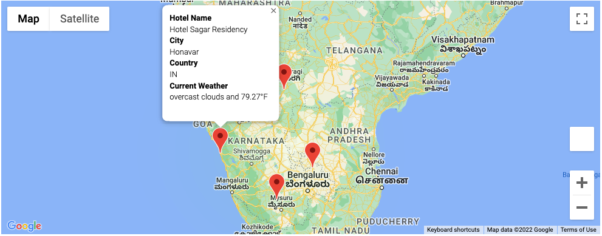

# World_Weather_Analysis

## Creating a travel planning app using APIs and Python 

The purpose of this project is to create a travel app that allows users to input their desired weather and receive a planned driving trip of four cities. We began this project by making an API request for 2000 random coordinates and traversing the returned JSON response to form an initial data frame. Next, we extracted hotel data through another API call and rendered a marker layer map. This map can be seen below in **figure 1.1**.

**Figure 1.1** 

After the creation of this map, we entered our desired weather and made directions and marker layer maps with city desitinations and pop-ups that illustrate the hotel name, city, country, and current weather description. These two maps can been seen in **figure 1.2** and **figure 1.3**. 

**Figure 1.2**

**Figure 1.3**

Upon completion of these features, we have finished our app. 
